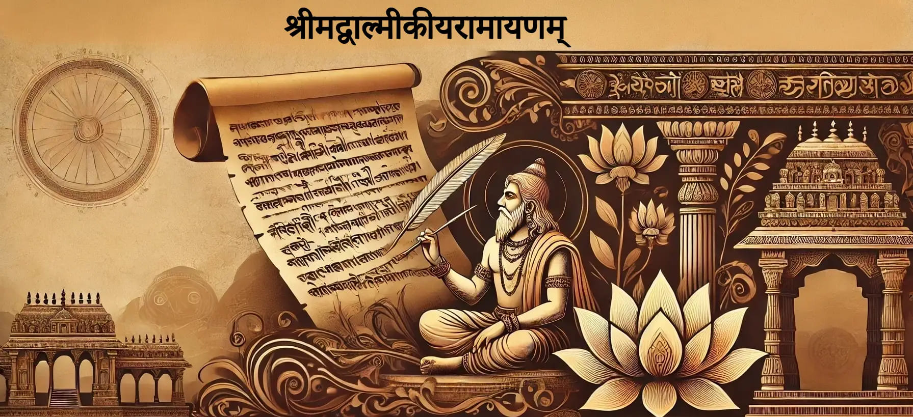

# श्रीमद्वाल्मीकीयरामायणम् (Ṣrīmadvālmīkīya*rāmāyaṇam*)

**[श्रीमद्रामायणस्य पठनम्](https://ramayanam.thesanskritchannel.org/)**

This Project is an effort to provide the text of the Valmiki Ramayanam in a structured format. The text is fetched from the [Valmiki Ramayanam - Wikisource](https://sa.wikisource.org/wiki/रामायणम्) crosschecking from the Book [`ShrimadValmikiRamayanam by R.Narayanaswamy`](https://archive.org/details/361952998SrimadValmikiRamayanaSanskrit1933AD/page/n5/mode/2up) (can be downloaded from [here](https://github.com/shubhattin/valmiki_ramayanam/releases/tag/book)) and processed to provide the text in various formats.

We also aim to provide Translations and *Transliterations* of the text in various languages.

This project is a collaborative effort with the support of various contributors working of various things, especially
[ The Sanskrit Channel](https://www.youtube.com/c/thesanskritchannel).

**[Techinal Details](./Technical_Details.md)**
